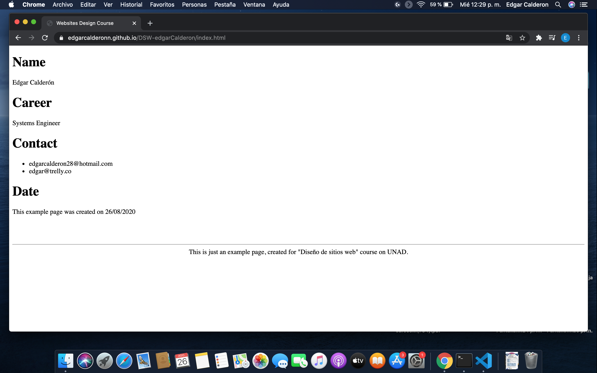

# DSW-edgarCalderon

Is just a simple example page for the course "Diseño de sitios web".

## Live version
You can find a live version of the page [here](https://edgarcalderonn.github.io/DSW-edgarCalderon/index.html)



## Getting Started

These instructions will get you a copy of the project up and running on your local machine for development and testing purposes.

```
git clone https://github.com/EdgarCalderonn/DSW-edgarCalderon.git
```

## Deployment
As it's just a simple html file, you can deploy it with any server you prefer, for example in python 3:

```
python3 -m http.server [PORT]
```

for example:
```
python3 -m http.server 8080
```

No you'll be able to access to http://localhost:[PORT], in the example case http://localhost:8080.


## Authors

* **Edgar Calderon** - [EdgarCalderonn](https://github.com/edgarcalderonn)

## License

[MIT](https://choosealicense.com/licenses/mit/)


